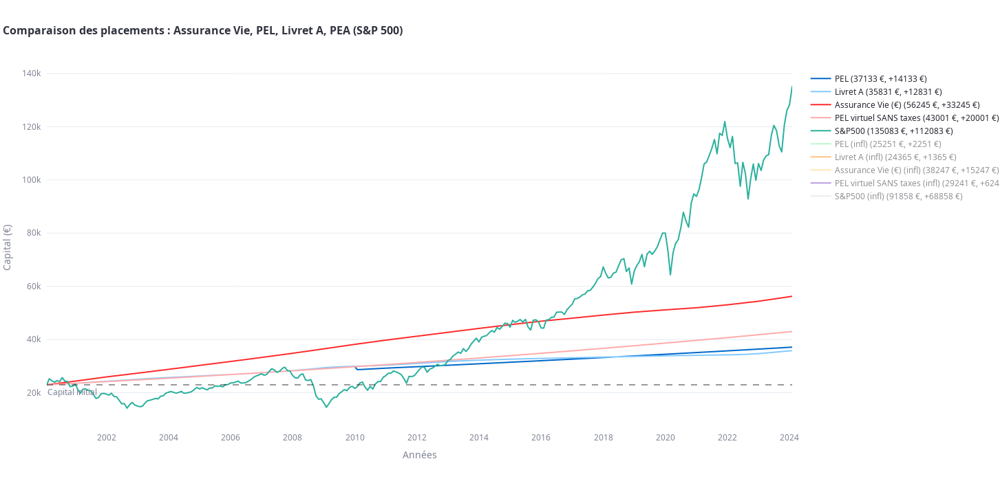

*The graphic illustration presented is not a reliable indicator of
the future performance of your investments. Its sole purpose is to
illustrate the mechanisms of an investment over the investment period.*

---

## Features

- Comparison of returns on Livret A savings accounts, PEL savings accounts, Euro-denominated life insurance, and the S&P 500;
- Taxation taken into account;
- Calculation of compound annual growth rate (CAGR);
- Adjustment for inflation;
- Variable simulation dates and durations;
- Simulation of a “virtual PEL” without taxation to compare perception vs. reality;
- Calculation of amounts received after taxation.

## Installation

### From sources

```bash
git clone https://github.com/ysard/pyfi.git
cd pyfi
```

### Install requirements

Preferably in a virtual environment:
    
```bash
$ pip install -r requirements.txt
```

## Usage

For the local web browser app:
    
```
$ make
```

Only for the matplotlib graph:
    
```
$ make local_portfolios
```
